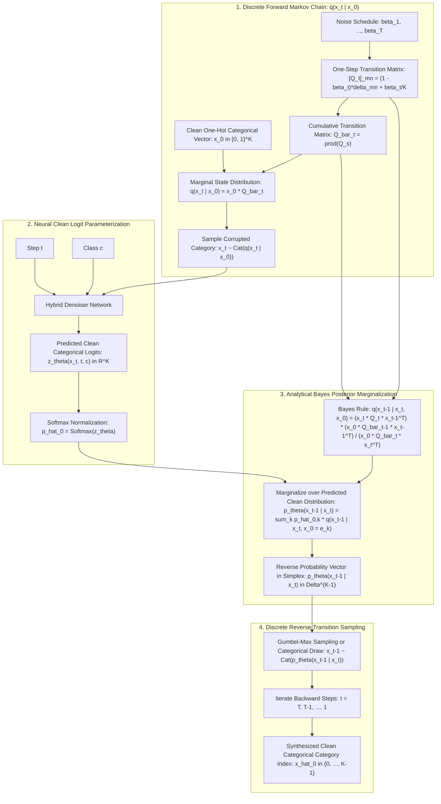

# Figure 4: Categorical Multinomial Diffusion (D3PM) Process

```mermaid
flowchart TD
    subgraph ForwardMarkov["1. Discrete Forward Markov Chain: q(x_t | x_0)"]
        X0["Clean One-Hot Categorical Vector: x_0 in {0, 1}^K"]
        BetaSchedule["Noise Schedule: beta_1, ..., beta_T"] --> TransMatrix["One-Step Transition Matrix: [Q_t]_mn = (1 - beta_t)*delta_mn + beta_t/K"]
        TransMatrix --> CumMatrix["Cumulative Transition Matrix: Q_bar_t = prod(Q_s)"]
        X0 --> ForwardMarginal["Marginal State Distribution: q(x_t | x_0) = x_0 * Q_bar_t"]
        CumMatrix --> ForwardMarginal
        ForwardMarginal --> CategoricalSample["Sample Corrupted Category: x_t ~ Cat(q(x_t | x_0))"]
    end

    subgraph NeuralPrediction["2. Neural Clean Logit Parameterization"]
        CategoricalSample --> Denoiser["Hybrid Denoiser Network"]
        Timestep["Step t"] --> Denoiser
        Condition["Class c"] --> Denoiser
        Denoiser --> RawLogits["Predicted Clean Categorical Logits: z_theta(x_t, t, c) in R^K"]
        RawLogits --> Softmax["Softmax Normalization: p_hat_0 = Softmax(z_theta)"]
    end

    subgraph AnalyticalPosterior["3. Analytical Bayes Posterior Marginalization"]
        TransMatrix --> PosteriorFormula["Bayes Rule: q(x_t-1 | x_t, x_0) = (x_t * Q_t * x_t-1^T) * (x_0 * Q_bar_t-1 * x_t-1^T) / (x_0 * Q_bar_t * x_t^T)"]
        CumMatrix --> PosteriorFormula
        Softmax --> Marginalize["Marginalize over Predicted Clean Distribution: p_theta(x_t-1 | x_t) = sum_k p_hat_0,k * q(x_t-1 | x_t, x_0 = e_k)"]
        PosteriorFormula --> Marginalize
        Marginalize --> PosteriorProbs["Reverse Probability Vector in Simplex: p_theta(x_t-1 | x_t) in Delta^(K-1)"]
    end

    subgraph ReverseSampling["4. Discrete Reverse Transition Sampling"]
        PosteriorProbs --> GumbelMax["Gumbel-Max Sampling or Categorical Draw: x_t-1 ~ Cat(p_theta(x_t-1 | x_t))"]
        GumbelMax --> ReverseLoop["Iterate Backward Steps: t = T, T-1, ..., 1"]
        ReverseLoop --> X0_Final["Synthesized Clean Categorical Category Index: x_hat_0 in {0, ..., K-1}"]
    end
```
