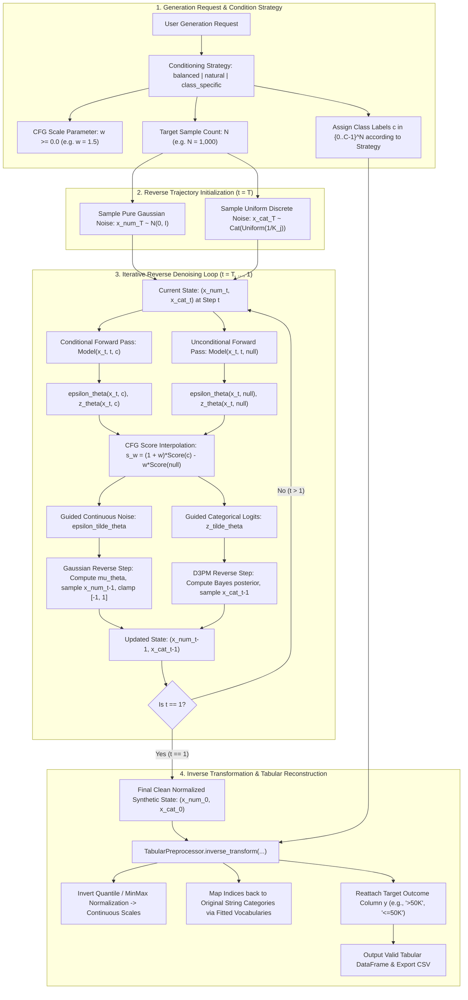

# Figure 6: Class-Conditional Generation Pipeline with Classifier-Free Guidance (CFG)

```mermaid
flowchart TD
    subgraph UserSpec["1. Generation Request & Condition Strategy"]
        User["User Generation Request"] --> SpecStrategy["Conditioning Strategy: balanced | natural | class_specific"]
        SpecStrategy --> GuidanceScale["CFG Scale Parameter: w >= 0.0 (e.g. w = 1.5)"]
        SpecStrategy --> NumSamples["Target Sample Count: N (e.g. N = 1,000)"]
        SpecStrategy --> SampleClasses["Assign Class Labels c in {0..C-1}^N according to Strategy"]
    end

    subgraph TrajectoryInit["2. Reverse Trajectory Initialization (t = T)"]
        NumSamples --> InitCont["Sample Pure Gaussian Noise: x_num_T ~ N(0, I)"]
        NumSamples --> InitCat["Sample Uniform Discrete Noise: x_cat_T ~ Cat(Uniform(1/K_j))"]
    end

    subgraph ReverseStepLoop["3. Iterative Reverse Denoising Loop (t = T, ..., 1)"]
        InitCont --> StepIn["Current State: (x_num_t, x_cat_t) at Step t"]
        InitCat --> StepIn
        
        StepIn --> CondPass["Conditional Forward Pass: Model(x_t, t, c)"]
        StepIn --> UncondPass["Unconditional Forward Pass: Model(x_t, t, null)"]
        
        CondPass --> CondOutputs["epsilon_theta(x_t, c), z_theta(x_t, c)"]
        UncondPass --> UncondOutputs["epsilon_theta(x_t, null), z_theta(x_t, null)"]
        
        CondOutputs --> ScoreInterpolation["CFG Score Interpolation: s_w = (1 + w)*Score(c) - w*Score(null)"]
        UncondOutputs --> ScoreInterpolation
        
        ScoreInterpolation --> GuidedEps["Guided Continuous Noise: epsilon_tilde_theta"]
        ScoreInterpolation --> GuidedLogits["Guided Categorical Logits: z_tilde_theta"]
        
        GuidedEps --> GaussianStep["Gaussian Reverse Step: Compute mu_theta, sample x_num_t-1, clamp [-1, 1]"]
        GuidedLogits --> D3PMStep["D3PM Reverse Step: Compute Bayes posterior, sample x_cat_t-1"]
        
        GaussianStep --> NextState["Updated State: (x_num_t-1, x_cat_t-1)"]
        D3PMStep --> NextState
        NextState --> LoopCheck{"Is t == 1?"}
        LoopCheck -- "No (t > 1)" --> StepIn
    end

    subgraph Finalization["4. Inverse Transformation & Tabular Reconstruction"]
        LoopCheck -- "Yes (t == 1)" --> CleanNormalized["Final Clean Normalized Synthetic State: (x_num_0, x_cat_0)"]
        CleanNormalized --> InvPrep["TabularPreprocessor.inverse_transform(...)"]
        SampleClasses --> InvPrep
        InvPrep --> UnscaleCont["Invert Quantile / MinMax Normalization -> Continuous Scales"]
        InvPrep --> DecodeCat["Map Indices back to Original String Categories via Fitted Vocabularies"]
        InvPrep --> AttachTarget["Reattach Target Outcome Column y (e.g., '>50K', '<=50K')"]
        AttachTarget --> FinalCSV["Output Valid Tabular DataFrame & Export CSV"]
    end
```
