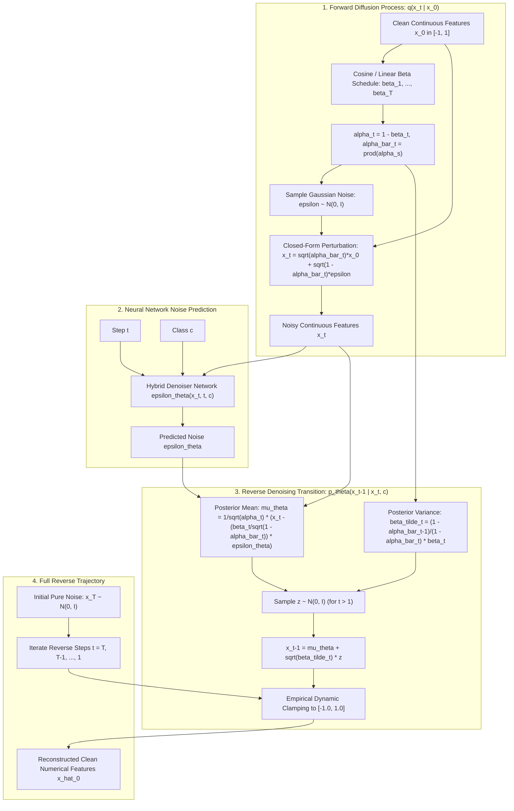

# Figure 3: Numerical Gaussian Diffusion Process

```mermaid
flowchart TD
    subgraph ForwardProcess["1. Forward Diffusion Process: q(x_t | x_0)"]
        X0["Clean Continuous Features x_0 in [-1, 1]"] --> Schedule["Cosine / Linear Beta Schedule: beta_1, ..., beta_T"]
        Schedule --> AlphaCalc["alpha_t = 1 - beta_t, alpha_bar_t = prod(alpha_s)"]
        AlphaCalc --> NoiseSample["Sample Gaussian Noise: epsilon ~ N(0, I)"]
        X0 --> ForwardFormula["Closed-Form Perturbation: x_t = sqrt(alpha_bar_t)*x_0 + sqrt(1 - alpha_bar_t)*epsilon"]
        NoiseSample --> ForwardFormula
        ForwardFormula --> Xt["Noisy Continuous Features x_t"]
    end

    subgraph Denoiser["2. Neural Network Noise Prediction"]
        Xt --> Model["Hybrid Denoiser Network epsilon_theta(x_t, t, c)"]
        Timestep["Step t"] --> Model
        Condition["Class c"] --> Model
        Model --> PredictedNoise["Predicted Noise epsilon_theta"]
    end

    subgraph ReverseProcess["3. Reverse Denoising Transition: p_theta(x_t-1 | x_t, c)"]
        PredictedNoise --> MeanCalc["Posterior Mean: mu_theta = 1/sqrt(alpha_t) * (x_t - (beta_t/sqrt(1 - alpha_bar_t)) * epsilon_theta)"]
        Xt --> MeanCalc
        AlphaCalc --> VarianceCalc["Posterior Variance: beta_tilde_t = (1 - alpha_bar_t-1)/(1 - alpha_bar_t) * beta_t"]
        MeanCalc --> ReverseSample["Sample z ~ N(0, I) (for t > 1)"]
        VarianceCalc --> ReverseSample
        ReverseSample --> XtMinus1["x_t-1 = mu_theta + sqrt(beta_tilde_t) * z"]
        XtMinus1 --> Clamping["Empirical Dynamic Clamping to [-1.0, 1.0]"]
    end

    subgraph Trajectory["4. Full Reverse Trajectory"]
        XT["Initial Pure Noise: x_T ~ N(0, I)"] --> Loop["Iterate Reverse Steps t = T, T-1, ..., 1"]
        Loop --> Clamping
        Clamping --> X0_Pred["Reconstructed Clean Numerical Features x_hat_0"]
    end
```
