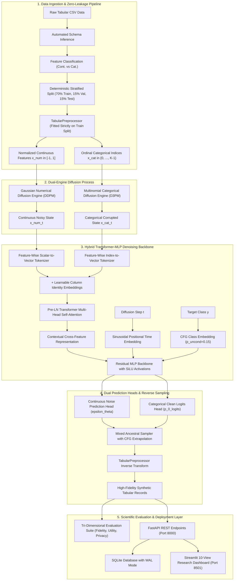

# Figure 1: End-to-End System Architecture

```mermaid
flowchart TD
    subgraph Layer1["1. Data Ingestion & Zero-Leakage Pipeline"]
        RawCSV["Raw Tabular CSV Data"] --> SchemaEngine["Automated Schema Inference"]
        SchemaEngine --> TypeDetection["Feature Classification (Cont. vs Cat.)"]
        TypeDetection --> Splitter["Deterministic Stratified Split (70% Train, 15% Val, 15% Test)"]
        Splitter --> Preprocessor["TabularPreprocessor (Fitted Strictly on Train Split)"]
        Preprocessor --> ScaledCont["Normalized Continuous Features x_num in [-1, 1]"]
        Preprocessor --> EncodedCat["Ordinal Categorical Indices x_cat in {0, ..., K-1}"]
    end

    subgraph Layer2["2. Dual-Engine Diffusion Process"]
        ScaledCont --> GaussDiff["Gaussian Numerical Diffusion Engine (DDPM)"]
        EncodedCat --> D3PMDiff["Multinomial Categorical Diffusion Engine (D3PM)"]
        GaussDiff --> NoisyCont["Continuous Noisy State x_num_t"]
        D3PMDiff --> NoisyCat["Categorical Corrupted State x_cat_t"]
    end

    subgraph Layer3["3. Hybrid Transformer-MLP Denoising Backbone"]
        NoisyCont --> ContTok["Feature-Wise Scalar-to-Vector Tokenizer"]
        NoisyCat --> CatTok["Feature-Wise Index-to-Vector Tokenizer"]
        ContTok --> ColEmbed["+ Learnable Column Identity Embeddings"]
        CatTok --> ColEmbed
        ColEmbed --> Transformer["Pre-LN Transformer Multi-Head Self-Attention"]
        Transformer --> InterColRep["Contextual Cross-Feature Representation"]
        Timestep["Diffusion Step t"] --> SinTime["Sinusoidal Positional Time Embedding"]
        ClassLabel["Target Class y"] --> CFGDropout["CFG Class Embedding (p_uncond=0.15)"]
        InterColRep --> ResidualMLP["Residual MLP Backbone with SiLU Activations"]
        SinTime --> ResidualMLP
        CFGDropout --> ResidualMLP
    end

    subgraph Layer4["4. Dual Prediction Heads & Reverse Sampling"]
        ResidualMLP --> NumHead["Continuous Noise Prediction Head (epsilon_theta)"]
        ResidualMLP --> CatHead["Categorical Clean Logits Head (p_0_logits)"]
        NumHead --> AncestralSampler["Mixed Ancestral Sampler with CFG Extrapolation"]
        CatHead --> AncestralSampler
        AncestralSampler --> InvTransform["TabularPreprocessor Inverse Transform"]
        InvTransform --> SyntheticTable["High-Fidelity Synthetic Tabular Records"]
    end

    subgraph Layer5["5. Scientific Evaluation & Deployment Layer"]
        SyntheticTable --> EvalSuite["Tri-Dimensional Evaluation Suite (Fidelity, Utility, Privacy)"]
        SyntheticTable --> APIServer["FastAPI REST Endpoints (Port 8000)"]
        APIServer --> SQLiteWAL["SQLite Database with WAL Mode"]
        APIServer --> StreamlitUI["Streamlit 10-View Research Dashboard (Port 8501)"]
    end
```
